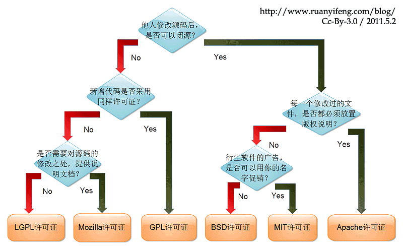

## 开源License的区别

六种license区别：



## 资源

[GitHub Docs 官方中文文档](https://docs.github.com/cn/github)

[Git简易指南](https://www.bootcss.com/p/git-guide/)

## 从GitHub新建开始

- 工作目录；
- 缓存区 Index
- Head

```bash
# 从GitHub新建仓库, 本地运行git clone并进入后

# 做一些改动

# add changes to Index
# git add <filename>, i.e.
git add *
# 撤销在add中的修改
# git reset HEAD <filename>

# commit to HEAD
git commit -m "代码提交信息"

# push to remote
# git push <remote name> <local name>, i.e.
git push origin main

# 查看分支
git branch
```

